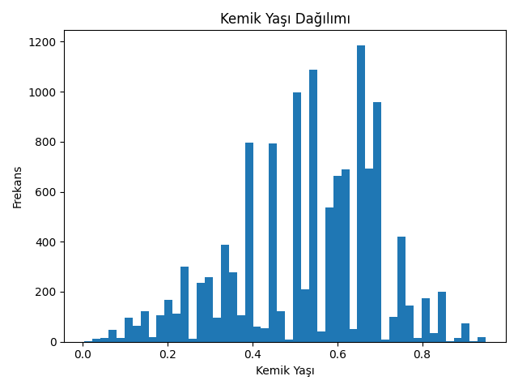
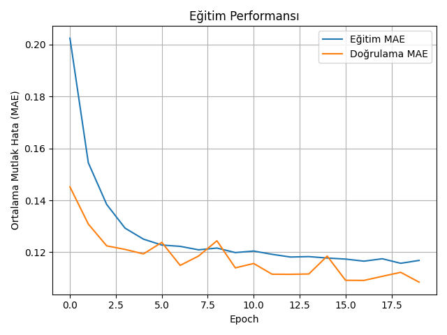
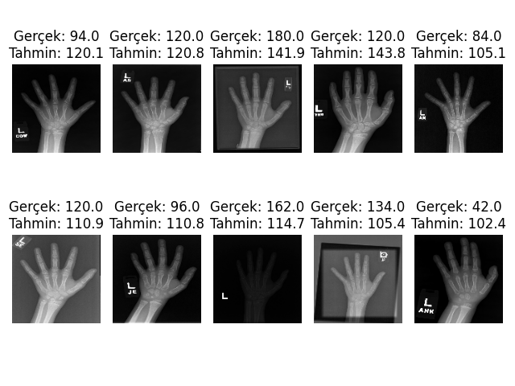

# RSNA Kemik Yaşı Tahmini (Bone Age Prediction)


Bu proje, el röntgen görüntülerini kullanarak çocukların kemik yaşını (ay cinsinden) tahmin eden derin öğrenme tabanlı bir **Regresyon** modelidir. Model, **Konvolüsyonel Sinir Ağları (CNN)** kullanılarak oluşturulmuş ve RSNA Kemik Yaşı veri seti üzerinde eğitilmiştir.

## 📋 İçindekiler
- [Proje Hakkında](#proje-hakkında)
- [Veri Seti ve Klasör Yapısı](#veri-seti-ve-klasör-yapısı)
- [Kurulum](#kurulum)
- [Kullanım](#kullanım)
- [Model Mimarisi](#model-mimarisi)
- [Sonuçlar](#sonuçlar)

## 🧐 Proje Hakkında
Tıbbi görüntüleme alanında, çocukların gelişim takibi için kemik yaşı tespiti önemlidir. Bu proje, manuel ölçümlerin getirdiği zaman kaybını ve hata payını en aza indirmek amacıyla otomatik bir tahmin sistemi sunar.

**Öne Çıkan Özellikler:**
* **Görüntü İşleme:** OpenCV ile gri tonlama, yeniden boyutlandırma (128x128) ve normalizasyon.
* **Veri Artırma (Data Augmentation):** Modelin genelleme yeteneğini artırmak için `ImageDataGenerator` kullanımı.
* **Özelleştirilmiş CNN:** Regresyon problemi için optimize edilmiş mimari.
* **Callbacks:** `EarlyStopping`, `ModelCheckpoint` ve `ReduceLROnPlateau` ile verimli eğitim.

## 📂 Veri Seti ve Klasör Yapısı
Bu proje **Kaggle** üzerindeki RSNA Bone Age veri setini kullanır. 

1.  Veri setini şu adresten indirin: [RSNA Bone Age Dataset](https://www.kaggle.com/datasets/kmader/rsna-bone-age)
2.  İndirdiğiniz dosyaları proje ana dizinine çıkarın. Klasör yapınızın aşağıdaki gibi olduğundan emin olun:

```text
proje-klasoru/
│
├── boneage-training-dataset/  # Resimlerin olduğu klasör (Kaggle'dan inen)
│   ├── 1377.png
│   ├── 1378.png
│   └── ...
├── boneage-training-dataset.csv  # Etiket dosyası
├── result_img
├── main.py                    # Python kodunuz
├── requirements.txt           # Gerekli kütüphaneler
└── README.md
```

## 📸 Sonuçlar

Modelin test aşamasındaki performansı ve elde edilen grafikler aşağıdadır:

### 1. Veri Seti Dağılımı


### 2. Eğitim Performansı (Loss/MAE)


### 3. Örnek Tahminler

