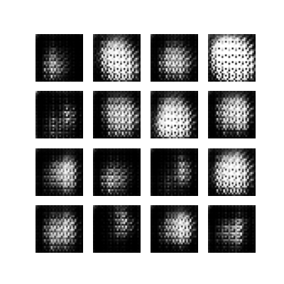
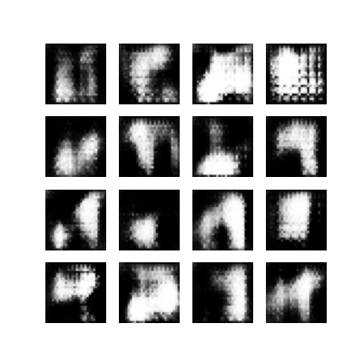
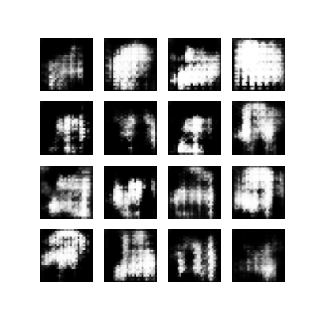
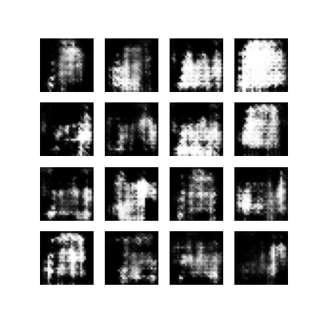

# 🧥 Fashion MNIST - DCGAN ile Görüntü Üretimi

Bu proje, **TensorFlow** ve **Keras** kullanılarak oluşturulmuş bir **DCGAN (Deep Convolutional Generative Adversarial Network)** uygulamasıdır. Model, **Fashion MNIST** veri setindeki kıyafet görüntülerini öğrenerek, rastgele gürültüden (noise) tamamen yeni ve yapay kıyafet tasarımları üretir.

## 🎯 Proje Hakkında

GAN (Çekişmeli Üretici Ağlar), birbirleriyle yarışan iki sinir ağından oluşur:

1.  **Generator (Üretici):** Rastgele sayısal gürültüyü alıp gerçekçi bir resme dönüştürmeye çalışır.
2.  **Discriminator (Ayırt Edici):** Kendisine gelen resmin gerçek (veri setinden) mi yoksa sahte (Generator üretimi) mi olduğunu anlamaya çalışır.

Bu projede, eğitim süreci boyunca Generator daha gerçekçi resimler üretmeyi öğrenirken, Discriminator da sahteleri daha iyi yakalamayı öğrenir.

## 🖼️ Üretilen Görüntüler (Eğitim Süreci)

Aşağıda, eğitim süreci boyunca (Epoch'lar ilerledikçe) modelin gürültüden anlamlı kıyafetler oluşturma sürecini gösteren örnekler yer almaktadır:

| Başlangıç (Epoch 1) | Gelişme (Epoch 5) |
| :---: | :---: |
|  |  |
| **Gelişme (Epoch 10)** | **Sonuç (Epoch 20)** |
|  |  |

