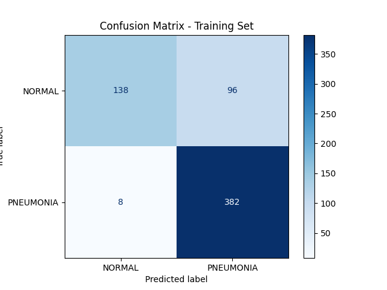

# 🩻 DenseNet121 ile Zatürre (Pneumonia) Tespiti

Bu proje, **Derin Öğrenme (Deep Learning)** ve **Transfer Learning** yöntemlerini kullanarak akciğer röntgeni (X-Ray) görüntüleri üzerinden zatürre teşhisi koymayı amaçlar. Model, önceden eğitilmiş **DenseNet121** mimarisini temel alır ve %90+ başarı oranını hedefler.

## 📌 Proje Hakkında

Proje, Kaggle üzerindeki "Chest X-Ray Images (Pneumonia)" veri setini kullanır. Görüntüleri "NORMAL" ve "PNEUMONIA" (Zatürre) olarak iki sınıfa ayırır.

Kullanılan temel teknikler:
* **Transfer Learning:** ImageNet ağırlıklarıyla eğitilmiş DenseNet121.
* **Data Augmentation:** Eğitim verisini çeşitlendirmek için döndürme, parlaklık ve yatay çevirme işlemleri.
* **Callbacks:** Early Stopping, Model Checkpoint ve Learning Rate azaltma stratejileri.

## 📂 Veri Seti

Veri setini aşağıdaki linkten indirebilirsiniz:
[Kaggle - Chest X-Ray Images (Pneumonia)](https://www.kaggle.com/datasets/paultimothymooney/chest-xray-pneumonia)

**Önemli:** İndirdiğiniz veri setini proje klasörüne `chest_xray` adıyla çıkartmalısınız.

## 📊 Çıktı

