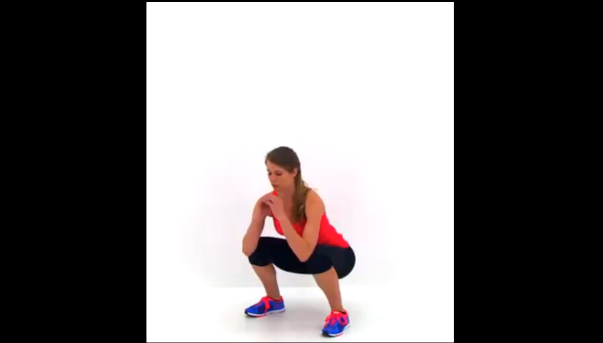
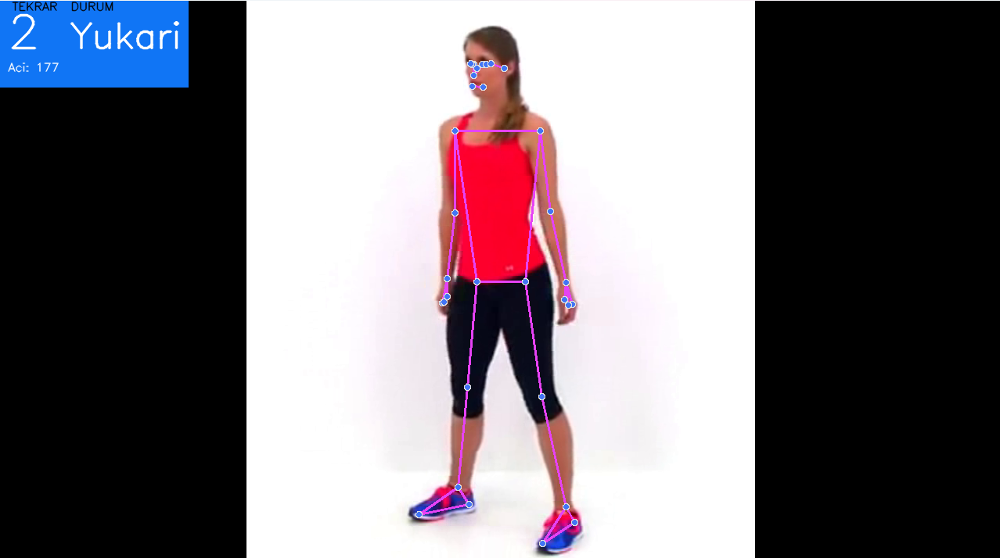

# 🏋️‍♂️ AI Destekli Squat Sayacı (AI Squat Counter)

Bu proje, **Python**, **OpenCV** ve **MediaPipe** kütüphanelerini kullanarak gerçek zamanlı görüntü işleme ile squat egzersizlerini takip eden, açıları hesaplayan ve tekrarları otomatik olarak sayan bir uygulamadır.

## 📋 İçindekiler
- [Proje Hakkında](#proje-hakkında)
- [Özellikler](#özellikler)
- [Kurulum](#kurulum)
- [Kullanım](#kullanım)
- [Algoritma Mantığı](#algoritma-mantığı)
- [Gereksinimler](#gereksinimler)

## 🚀 Proje Hakkında
Bu uygulama, webcam veya video dosyası üzerinden insan vücudunu algılar ve **Kalça - Diz - Ayak Bileği** noktaları arasındaki açıyı trigonometrik olarak hesaplar. Bu açıya göre kişinin "Eğilme" (Squat Down) veya "Kalkma" (Squat Up) durumunda olduğunu belirleyerek tekrarları sayar.

## ✨ Özellikler
* **Gerçek Zamanlı İskelet Takibi:** MediaPipe Pose modeli ile yüksek doğrulukta vücut analizi.
* **Otomatik Açı Hesaplama:** NumPy kullanılarak eklem açılarının anlık hesaplanması.
* **Durum Analizi:** "Hazır", "Aşağı" ve "Yukarı" durumlarını algılama.
* **Görsel Arayüz:** Ekranda anlık tekrar sayısı, hareket durumu ve açı değerinin gösterimi.
* **Hata Toleransı:** Görüntüde insan algılanamadığında programın çökmesini engelleyen yapı.

## 📸 Sonuçlar

Modelin test aşamasındaki performansı aşağıda gösterilmiştir.

<table>
  <tr>
    <td align="center" width="50%"><b>Orijinal Görüntü</b></td>
    <td align="center" width="50%"><b>Tespit Sonucu</b></td>
  </tr>
  <tr>
    <td></td>
    <td></td>
  </tr>
</table>
