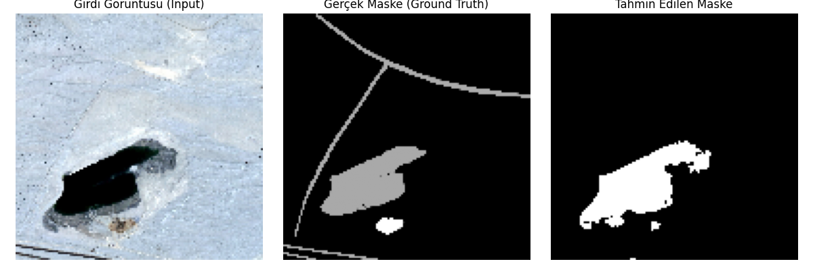

# 🛰️ Aerial Imagery Semantic Segmentation with U-Net

Bu proje, **U-Net** derin öğrenme mimarisini kullanarak hava görüntüleri (aerial imagery) üzerinde **anlamsal segmentasyon (semantic segmentation)** işlemini gerçekleştirir. Amaç, uydu veya drone görüntülerindeki belirli alanları (örneğin binalar, yollar veya su kütleleri) piksel bazında sınıflandırmaktır.


## 📌 Proje Hakkında

Bu çalışmada, Encoder-Decoder yapısına sahip olan ve biyomedikal görüntü segmentasyonu için geliştirilmiş ancak hava görüntülerinde de çok başarılı olan **U-Net** modeli kullanılmıştır.

**Modelin Temel Özellikleri:**
* **Encoder (Daraltma Yolu):** Görüntüden özellikleri (kenar, doku vb.) çıkarır.
* **Decoder (Genişletme Yolu):** Özellik haritasını orijinal görüntü boyutuna geri döndürür.
* **Skip Connections (Atlama Bağlantıları):** Encoder'daki detaylı konumsal bilgileri Decoder'a aktararak segmentasyonun daha keskin sınırlarla yapılmasını sağlar.

## 📂 Veri Seti (Dataset)

Projede kullanılan veri seti Kaggle üzerinden temin edilmiştir:
[Semantic Segmentation of Aerial Imagery - Humans in the Loop](https://www.kaggle.com/datasets/humansintheloop/semantic-segmentation-of-aerial-imagery)

**Veri Seti Yapısı:**
Veri seti, farklı bölgeleri temsil eden "Tile" klasörlerinden oluşur. Her Tile içinde `images` (orijinal görüntü) ve `masks` (etiket/maske) klasörleri bulunur.

## 🚀 Kullanım

1.  İndirdiğiniz veri setini proje ana dizinine `aeiral_dataset` adıyla çıkarın. Klasör yapısı şöyle olmalıdır:
    ```
    aerial-segmentation-unet/
    ├── aeiral_dataset/
    │   ├── Tile 1/
    │   │   ├── images/
    │   │   └── masks/
    │   ├── Tile 2/
    │   └── ...
    ├── main.py
    └── README.md
    ```

2.  **Eğitimi başlatın:**
    ```bash
    python app.py
    ```

Kod çalıştırıldığında:
* Veriler yüklenir ve ön işleme (resize, normalize) yapılır.
* U-Net modeli oluşturulur ve eğitim başlar.
* En iyi model `model_best.h5` olarak kaydedilir.
* Eğitim sonunda kayıp (loss) grafiği ve örnek tahmin sonuçları ekranda gösterilir.

## 📊 Sonuçlar

### Eğitim Grafiği
Model 20 epoch boyunca eğitilmiş ve `binary_crossentropy` kaybı minimize edilmiştir.

*(Buraya eğitim sonucunda çıkan loss grafiğinizin ekran görüntüsünü ekleyebilirsiniz. Örn: ``)*

### Tahmin Örnekleri
Aşağıda modelin doğrulama setindeki başarısı görülmektedir:



*(Not: `show_predictions` fonksiyonundan aldığınız çıktıyı buraya görsel olarak eklemeniz projeyi inceleyenler için çok faydalı olacaktır.)*

## 🛠️ Kullanılan Teknolojiler

* **TensorFlow / Keras:** Model mimarisi ve eğitim.
* **OpenCV:** Görüntü okuma ve işleme.
* **NumPy:** Matris işlemleri.
* **Matplotlib:** Veri görselleştirme.
* **Scikit-Learn:** Veri setini eğitim/test olarak ayırma.

## 📝 Lisans

Bu proje MIT lisansı ile lisanslanmıştır. Detaylar için `LICENSE` dosyasına bakınız.
