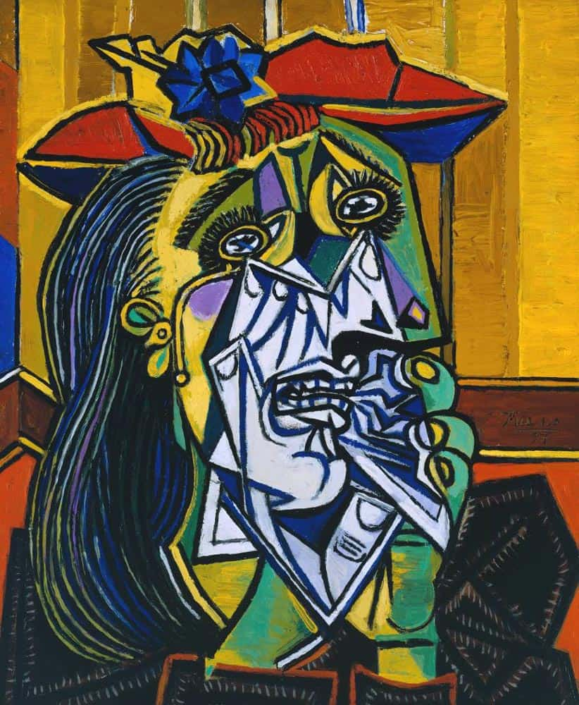
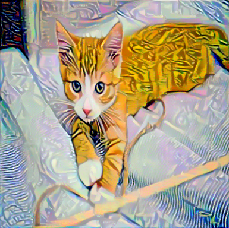

# PyTorch ile Sinirsel Stil Aktarımı (Neural Style Transfer)

Bu proje, PyTorch kullanarak **Neural Style Transfer (NST)** algoritmasının bir uygulamasını içerir. Leon A. Gatys ve arkadaşlarının geliştirdiği bu teknik, bir görüntünün (içerik) ana hatlarını korurken, başka bir görüntünün (stil) sanatsal dokusunu ve renklerini ona aktararak yeni bir sanat eseri oluşturur.

## 🚀 Özellikler

* **VGG19 Mimarisi:** Özellik çıkarımı (feature extraction) için önceden eğitilmiş VGG19 ağı kullanılır.
* **Gram Matrisi:** Stil temsili için Gram Matrisleri hesaplanır.
* **Özelleştirilebilir Ağırlıklar:** Stil ve içerik dengesi (alpha/beta oranı) ayarlanabilir.
* **CUDA Desteği:** GPU varsa otomatik algılar ve işlemi hızlandırır.
* **İlerleme Çubuğu:** `tqdm` kütüphanesi ile eğitim adımları görsel olarak takip edilebilir.

## 🧠 Teknik Detaylar

* Görüntü Yükleme: Resimler yüklenir, VGG19'un beklediği boyuta ve normalizasyon değerlerine getirilir.
* Model: VGG19'un "features" kısmı alınır ve ağırlıkları dondurulur (frozen).
* Kayıp Fonksiyonları (Loss Functions):
* Content Loss: conv4_2 katmanındaki özellik farkları.
* Style Loss: conv1_1'den conv5_1'e kadar olan katmanlardaki Gram Matris farkları.
* Optimizasyon: Orijinal resmin bir kopyası (target), Adam optimizasyonu ile her adımda güncellenerek stil ve içerik kaybını minimize etmeye çalışır.

## 📸 Sonuçlar

Modelin örnek çıktıları aşağıda verilmiştir

<table align="center">
  <tr>
    <td align="center" width="33%"><b>İçerik (Content)</b></td>
    <td align="center" width="33%"><b>Stil (Style)</b></td>
    <td align="center" width="33%"><b>Sonuç (Output)</b></td>
  </tr>
  <tr>
    <td></td>
    <td></td>
    <td></td>
  </tr>
</table>

