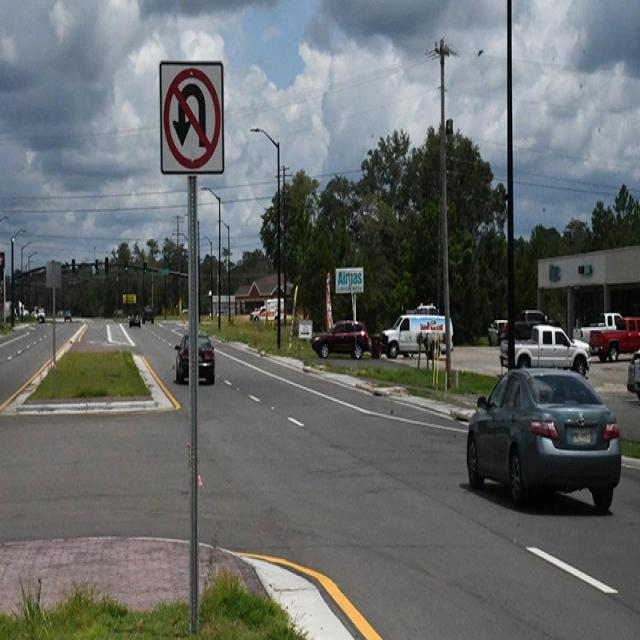
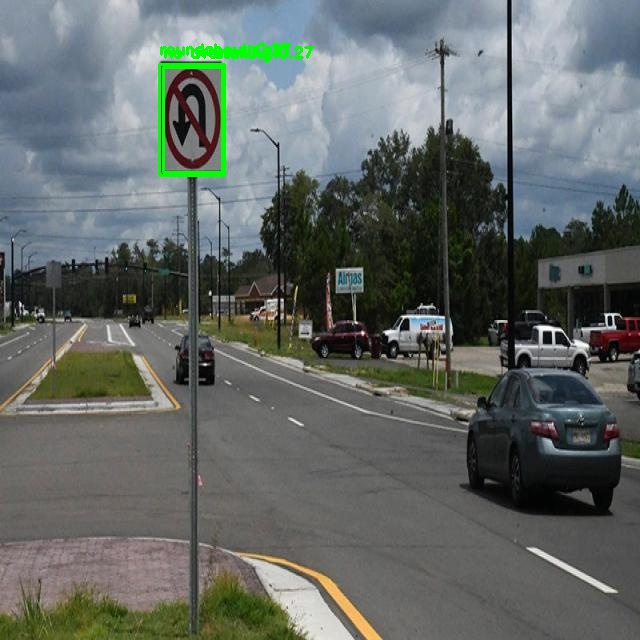

# 🚦 Traffic Sign Detection with YOLOv8

Bu proje, **YOLOv8 (You Only Look Once)** mimarisini kullanarak trafik levhalarını (hız sınırları, dur, girilmez vb.) gerçek zamanlı veya statik görüntüler üzerinde tespit etmek için geliştirilmiştir. Otonom sürüş ve trafik analizi sistemleri için temel bir prototip niteliğindedir.


## 📁 İçindekiler

- [Proje Hakkında](#-proje-hakkında)
- [Veri Seti](#-veri-seti)
- [Sonuçlar](#-sonuçlar)
- [Kurulum](#-kurulum)

---

## 🧐 Proje Hakkında

Bu proje, Ultralytics kütüphanesi kullanılarak eğitilmiş özel bir nesne algılama modelidir. Proje aşağıdaki adımları kapsar:
1. Trafik levhalarını içeren veri setinin hazırlanması.
2. YOLOv8n (Nano) modelinin bu veri seti ile eğitilmesi (Transfer Learning).
3. Eğitilen modelin OpenCV kullanılarak test edilmesi ve sonuçların görselleştirilmesi.

---

## 📊 Veri Seti

Modelin eğitimi için Roboflow Universe üzerindeki açık kaynaklı bir veri seti kullanılmıştır.

- **Veri Seti Adı:** Traffic Sign Detection
- **Kaynak:** [Roboflow Linki](https://universe.roboflow.com/university-km5u7/traffic-sign-detection-yolov8-awuus/dataset/11)
- **İçerik:** Eğitim (Train), Doğrulama (Valid) ve Test resimleri ile YOLO formatındaki etiketler.

> **Not:** Veri setini indirdikten sonra klasör yapısının `data.yaml` dosyası ile uyumlu olduğundan emin olun.

---

## 📸 Sonuçlar

Modelin test aşamasındaki performansı aşağıda gösterilmiştir.

<table>
  <tr>
    <td align="center"><b>Orijinal Görüntü</b></td>
    <td align="center"><b>Tespit Sonucu</b></td>
  </tr>
  <tr>
    <td></td>
    <td></td>
  </tr>
</table>


## ⚙️ Kurulum

Projeyi yerel makinenizde çalıştırmak için aşağıdaki adımları izleyin:

### 1. Projeyi Klonlayın
```bash
git clone [https://github.com/kullaniciadi/traffic-sign-detection.git](https://github.com/kullaniciadi/traffic-sign-detection.git)
cd traffic-sign-detection
